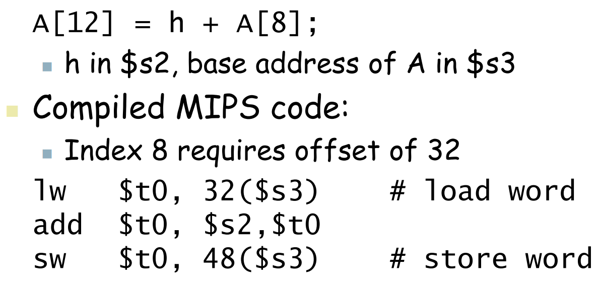
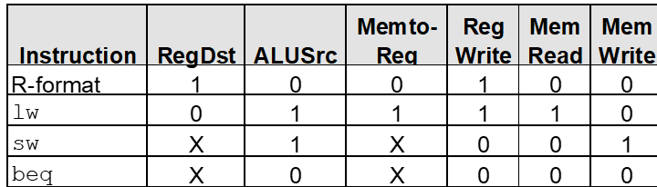
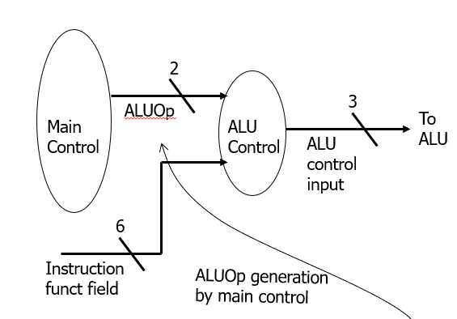

# 老头课内容


## 电路门


二进制乘法


全加器和半加器的区别是后者不考虑进位


补充：


注意**吸收律**，x+yz=(x+y)(x+z)用到了吸收律， **(x+y)(x+x')=x+xy+xx'+x'y=x+x'y 所以x+x'y可以推出x+y**


这里展示了一种新的运算**sum of product**，它用于构建**输入=输出**的布尔表达式


这里的sum 是x,y,cin的异或结果，**cout是在哪一位上进位了**，计算方式som和cout的sum of product的公式为：**先取出本变量二进制位上为1的位置，对于每个位置组合输入，如果该位置上的输入为0，则该输入取反，最后累和**。

术语：minterm——any possible of input 


下图称为Decoder，计算出输入在所有情况下的结果


下图是Multiplexer，将输入在所有情况下的结果又重新作为输入进行计算


1. **主内存（Main Memory）**：负责存储正在运行的程序和数据，是计算机的主要工作内存。

2. **缓存内存（Cache Memory）**：速度很快但容量较小，主要用于存储主内存中的部分内容，以加快CPU的访问速度。

3. **辅助存储（Secondary Memory）**：容量大但速度较慢，用于长期存储数据和程序，比如硬盘或固态硬盘。


One's Complement：对正数取反表示负数

**Two's Complement：补码**，注意特殊值

`

## Memory


时钟信号，脉冲指的是**一次上升和一次下降**


Latch（锁存器）：**输入**发送变化且**时钟信号被激活**，会响应并更新其状态，用于**记忆一位二进制数**

SR latch 一种基本的存储元件，属于锁存器的一种。它由两个输入（Set **设置为1**和 Reset**设置为0**）和两个输出（Q 和 Q' 就是not Q）组成，用于存储一个位（0 或 1）的信息，**不依赖于时钟信号**，可以随时响应输入信号。

Q+表示下一时刻Q的值，注意这里是NOR门，S和R的位置不能混淆,，运算时从s开始，R=S=1是不允许的状态。


Flip-flops（触发器）：状态变化仅在时钟信号的**上升和下降**发生，不会**随时响应**输入信号的变化，似乎只是锁存器加上了一个时钟信号


锁存器和触发器都是是时序电路


D-latch 加入了一个非门使原来的两个置位信号变为**一个**置位信号D(D为1**表示置1**)，**当C=1时电路的新状态为D** 否则不变 图中下面的那条线表示的是**时钟信号**，D锁存器不像SR能保持**状态不变**


寄存器和触发器都能储存**一位**的信息，通过把多个寄存器/触发器连接到一起可以储存多位


在分析一个电路图时，首先应该得出每个时序电路的输入公式

下图中两个寄存器的输入D1和D2的公式通过**线路反推**可得，D1=Q1'    D2=(X\^Q1\^Q2)


然后找出下一状态Q*的公式，这里因为是D触发器所以Q1\*=Q1’  Q2\*=(X\^Q1\^Q2)

最后判断输出的公式z=(Q1'Q2)


最后构建真值表，没有特殊的要求从N那个状态开始都行

|  X   |  Q2  |  Q1  | Q2*  | Q1*  | Z    |
| :--: | :--: | :--: | :--: | :--: | ---- |
|  0   |  0   |  0   |  0   |  1   | 0    |
|  1   |  0   |  0   |  1   |  1   | 0    |
|  0   |  0   |  1   |  1   |  0   | 0    |
|  1   |  0   |  1   |  0   |  0   | 0    |
|  0   |  1   |  0   |  1   |  1   | 1    |
|  1   |  1   |  0   |  0   |  1   | 1    |
|  0   |  1   |  1   |  0   |  0   | 0    |
|  1   |  1   |  1   |  1   |  0   | 0    |

除了真值表，还有时序表即从某一个状态开始即紧接着的是该状态的下一状态


为了更直观的表示，还有一种状态图的形式，这里的每个节点是**状态排列而成**Q2Q1，**不包括输入**，箭头指向的是**下一状态**，箭头上的是**INPUT/OUTPUT**，是当前状态到下一状态时的输入和输出


状态图不需要方方正正，可以有**自边**


下图展示的是一个3bit的内存图

A表示的是地址，CS是chip select，RD是读写，I表示的是数据位，这里有四排是因为共有四种zhuang'tai


移位寄存器，该结构一次脉冲会输入一位信号，这是**串行输入**的方式


分析驱动方程有


状态方程有


输出为Q3


观察得每一次脉冲后下一状态就是**当前状态右移一位得到的**


构建真值表发现，移位寄存器除了**可以移动数据**还可以实现**串行输出和并行输出**


## MIPS

### 基本概念

MIPS指令集是一种精简指令集计算架构，使用**32**个寄存器，每个寄存器宽**32位**（这种大小的位模式称为一个**字** ）。MIPS的数据排列方式是**Big Endian**即**数据的高位放在低地址上**，MIPS指令以**32位**表示。

**寄存器**是CPU内部的高速储存单元，用于**临时存储数据和指令**，MIPS框架下，执行算术运算时，通常**直接对寄存器内的数值操作**而不是直接操作**内存中的数据**。


该指令集第一个表示**操作**，其后是**左式**，最后的两个是用于**运算**的数，注意MIPS只能进行**两个数之间的运算**，三个及以上的需要用**多个式子**求解，变量的名字是有规律的，**t表示临时变量，s表示变量**，


内存用于**存储复杂的数据结构**，在执行算术运算时，需要从**内存中加载值到寄存器中**，然后将计算结果放回到内存中。内存的地址必须是**对齐**的，必须是**4的倍数**，用二进制表示就是**末两位为0**

MIPS代码是**从上往下**执行的

### 简单指令

注意这个偏于量不能是一个**寄存器**，只能是**整数**

`lb s0, offset($t0)`  取内存中offset($t0)位置的数据到s0中

`sb s0, offset($t0)` 将寄存器中\$s0中一个字节的数据放到offset(\$t0)指定的位置，注意这个顺序。

除了lb,sb还有**lw和sw**表示以**字**为单位取

偏移量offset是一个**16位**的补码从**-32768 到 32767**。括号中的表示这个变量的**基地址**


`la $register, label`  用于加载**标签**（或符号）的地址到寄存器中，一般是在.data中声明的数组，注意不能使用**寄存器**，只能使用**lw**从寄存器中取内容


`and t0, t1, $t2`将t1和t2**按位与**的结果放入t0

`or t0, t1, $t2`将t1和t2**按位或**的结果放入t0

`nor t0, t1, $zero`将t1和t2**按位或反**的结果放入t0


 `sll t1, s3, 2`将s3**左移两位**后的结果放入t1

 

`move $dest, $src` 将一个寄存器的值**复制到**另一个寄存器，注意不是移动

`mul $v0,$v0,$a0` 乘法指令


```assembly
div $t0, $t1    # 执行除法，$t0 / $t1

mflo $t2        # 从 $lo 中取出商（结果）
mfhi $t3        # 从 $hi 中取出余数
```


数组中的索引8是以**字**为单位的，MIPS中以**字节**为单位，所以换算为**offset偏移量就是32bytes**，对于这个代码先要做的就是**取出数组的值**放到临时变量中然后再进行计算




当索引不是常量时，首先将**索引乘上4**转换为偏移量，然后**和A相加**就得到**A[i]**所在位置，最后用**lw取出该位置的值**即可，此时的偏移量置为**0**


### 寄存器分类


MIPS中有一个**$zero**——0号寄存器，**它的内容永远是零**

PC是一个特殊的寄存器，用以储存**下一条指令**的地址，当一条指令执行完毕后会**自动加4**

**立即数**是一个**有符号常量**，它可以作为数据来源之一用于某些操作，而不是使用寄存器中的值，要使用立即数的话需要用到指令**addi**，例如**addi \$s3, $s3, 4**，这里没有**subi**指令，想实现**减法**就要用负数来做


### 三种指令类型

MIPS操作指令可以分为三种：**R型(寄存器型 寄存器寻址)，I型(立即数型 立即数寻址 基址寻址)，J型(跳转型 伪立即数寻址)** 内存中分配rs和rt的位置一般和MIPS指令的顺序是**反的**


OP：操作码，**所有R型指令都为0**	

rs rt rd分别是**两个源操作数**的**寄存器编号**和**目的操作数**的**寄存器编号**

shamt 常数，在移位指令中使用

func 功能码指定指令的**具体功能**

除了op是**六位**其他都是五位


OP 决定操作功能

rs immediate分别指第一个源操作数**寄存器编号**，和第二个源操作数（**16位的有符号整数**）

rt是目的操作数所在的**寄存器编号**


OP 确定操作类型

address/offfset 地址

实际的地址是**32**位的，MIPS采用了一种伪直接跳转的机制：将26位的地址**扩展**到32位——将**PC的高四位**与**26位地址**拼接，在**末尾补00**


### 判等

`beq rs, rt, L1`**判断是否相等**，如果相等则**跳转到L1**标签指定的位置，反之**继续往下**执行。注意该指令是I型指令，跳转到的位置是**PC+4+offset*4**（补高位+offset+00），这里的PC指向的是**当前位置**。

`bne rs, rt, L1`原理同上 注意比较的是**两个寄存器**中的值而不是寄存器与**整数**

观察下图，发现bne指令执行时如果成功，则会跳转到80024，这因为**PC+4+offset*4=80016+2\*4、


### 比较大小

比较\$rt和$rs的值将结果存到\$rd，注意是不等比较

`slt rd, rs, rt`  **if (rs < rt) rd = 1; else rd = 0;**

`slti rt, rs, constant`**if (rs < constant) rt = 1; else rt = 0;**


通过和bne指令结合实现**不等式判断**

`slt $t0, $s1, $s2`

`bne $t0, $zero, L` 


sltu, sltui比较的是**无符号整数**


上述多条指令较为麻烦，MIPS提供一些额外指令实现逻辑跳转

**`bgt`（Branch on Greater Than）**：如果第一个寄存器大于第二个寄存器，则跳转。

**`blt`（Branch on Less Than）**：如果第一个寄存器小于第二个寄存器，则跳转。

**`bge`（Branch on Greater or Equal）**：如果第一个寄存器大于或等于第二个寄存器，则跳转。

**`ble`（Branch on Less or Equal）**：如果第一个寄存器小于或等于第二个寄存器，则跳转


## More MIPS

### 汇编器指令


在 MIPS 中，*Assembler Directives*（汇编器指令）是用来指导汇编器如何处理代码的一种特殊指令。与 MIPS 指令不同，这些指令不会被直接翻译为机器代码，而是用于设置数据的布局、定义符号和存储器空间等。常见的汇编器指令有以下几种：

1. **`.text`**：用于定义**代码段**的起始位置。汇编器将把接下来的代码放入程序的代码段中。

2. **`.data`**：用于定义**数据段**的起始位置。汇编器会将接下来的数据放入数据段中。

3. **`.word`**：用于在内存中**分配一个或多个 32 位整数**。例如，`.word 5` 会将值 `5` 存入一个 32 位的存储空间中。

4. **`.asciiz`**：用于定义一个**以零字节（`null` 字符）结尾的字符串**。例如，`.asciiz "Hello"` 会在内存中存储字符串 `"Hello\0"`。

5. **`.globl`**：用于声明一个**全局标签**，使该标签在其他文件中可见。例如，`.globl main` 会使 `main` 标签在整个程序中可用。


### 系统调用

MIPS可以使用**系统调用system call**，系统调用最多**传四个参数\$a0 -\$a3** 在执行系统调用时**\$v0** 通常用来指定调用的**服务类型**，系统调用的**返回值**也会存在$v0中


li（Load Immediate）**将一个立即数加载到寄存器中**

la(Load Address) **将变量的地址加载到一个寄存器中**，注意该指令只能操作.data下声明的**变量**，而不能是一个**寄存器**

一般系统调用搭配这两种指令使用

```assembly
# 将一个立即数加载到 $v0 中
li $v0, 10  # 将 10 加载到 $v0，通常用于表示一个系统调用（如退出程序）
syscall      # 执行系统调用

la $a0,str   # 传递参数
li $v0,4    # 输出指令
syscall # to print
```


### jal指令


**jal**指令jump and link，可以看作是**调用函数**指令，执行后先把下一条指令的位置即**PC保存到$ra**，然后**跳转到函数的地址**上，在函数末尾使用**jr $ra**用来返回调用该函数的位置


### 例子

MIPS指令集中非常容易混淆寄存器，要注意

MIPS指令中跳转标签后要记得再跳回去，否则会迷失


遍历输出数组的代码

```assembly
.data
arr:  .word 7, 9, 4, 3, 8, 1, 6, 2, 5 # 注意这里需要用空格隔开每个数据

.text
.globl main # 规定了入口位置 注意拼写

main: 
	li $v0,1 # 设置系统调用，输出整数指令
	addi $t0,$0,0 # i=0 addi需要用到一个寄存器所以这里传入一个$0
	addi $t1,$0,9 # n=9
	la $t3,arr # 存储数组变量，用取址命令

loop:
	slt $t4,$t0,$t1 # i<n 如果是则t4=1 反之t4=0
	beq $t4,0, done # 这里的0是$0的简写，注意不能写除了0以外的整数 因为beq指令是比较寄存器nei'rong'de
	lw $a0,0($t3) # 用lw指令取出数组中的内容
	syscall
	addi $t3,$t3,4 # 更新索引
	addi $t0,$t0,1
	j loop

done:
	li $v0,10
	syscall
```


下面是一段遍历数组求和的代码

```assembly
.data 
arr: .word 1, 2, 3, 4, 5, 6, 7
msg: .asciiz " The sum of the arr is "

.text
.globl main

main: 
	li $t0,0 # i=0
	li $t1,7 # n=7
	li  $t2,0 # 总和
	la $t4,arr # 加载数组
loop:
	slt $t3,$t0,$t1 # i<n
	beq $t3,0,done
	lw $t3 ,0($t4) # 加载数组元素 注意要用lw
	add $t2,$t2,$t3	# 累和 这里用到的是两个寄存器，因此用add指令
	addi $t0,$t0,1
	addi $t4,$t4,4
	j loop

done:
	li $v0,4 # 输出字符串
	la $a0,msg	# 加载字符串向加载数组一样用la
	syscall

	li $v0, 1 # 输出数字
	add $a0,$0,$t2
	syscall 
	
	li $v0,10
	syscall
```


下面是一个将数组中所有的元素置为0的代码，值得一提的是 **sll和slt**容易混淆


```assembly
.data 
arr: .word 1, 2, 3, 4, 5, 6, 7

.text
.globl main

main: 
	li $t0,0 # i=0
	li $t1,7 # n=7
	la $t4,arr # 加载数组
loop:
	slt $t3,$t0,$t1 # i<n
	beq $t3,0,done
	
	sw $0, 0($t4) # 将数组元素置为0，可以用$0

	addi $t0,$t0,1
	addi $t4,$t4,4
	j loop

done:
	li $v0, 1 # 输出数字
	lw $t0,-4($t4) # 这里指针指向数组外边，因此用偏移量往回移
	move $a0,$t0 # 设置系统调用的参数
	syscall 
	
	li $v0,10
	syscall
```


取最大值

```assembly
arr:  .word 1, 2, 13, 4, 5

.text
.globl main

main:
    la,$a0,arr
    addi $a1,$0,5
    jal getMax # 设计为函数调用 
    move $a0,$v0
    li $v0 ,1
    syscall 
    li $v0 ,10
    syscall

getMax:
    lw $t0,0($a0) #   int mx = arr[0]; 
    addi $a0,$a0,4 # 接下来从1开始
    li $t1,1
    j maxLoop # 涉及到循环逻辑 需要将循环标记为一段
    
maxLoop :
    slt $t2,$t1,$a1
    beq $t2,0 maxDone # 遍历完成 退出
    
    lw $t3,0($a0)
    slt $t2,$t0,$t3
    beq $t2,1, convert # 取最大值 这里是跳转实现的因此要注意，跳转之后一定要再跳回来

next: # 按顺序执行会自动更新索引
    addi $a0,$a0,4    
    addi $t1,$t1,1
    j maxLoop 
 
maxDone:
    move $v0,$t0
    j $ra

convert:
    move $t0,$t3
    j next # 跳到更新索引逻辑


```


数组取值的另一种方式：不操作数组地址而是用一个索引值**>>2**，再与数组首地址**相加**求出索引所对的地址。

```assembly
$t1 ->idx
$v1 -> count数组

sll $t1,$t1,2 $ # 先左移2
add $t2,$t1,$v1 # 与数组首地址相加
```


顺带一提，给的C代码中的**arr[i]和i[arr]**等价


递归实现阶乘函数，**函数内部**调用任何函数之前一定要先保存**$ra**

```assembly
.globl .main
main:
	addi $a0,$0,5 # n=5
	jal fact # 调用函数
	move $a0,$v0 # 将函数返回结果放入#a0
	li $v0,1 # 输出数字
	syscall 
	
	li $v0 ,10 # 退出
	syscall

fact:
	slti $t1,$a0,1 # 如果小于1那么执行none 注意指令是slti
	beq $t1,1,none
	
	addi $sp,$sp,-8 # 开栈
	sw $ra,4($sp) # 储存返回值和n
	sw $a0,0($sp)
	addi $a0,$a0,-1 # n-=1
	jal fact # 递归
	lw $a0,0($sp) # 取出存放在栈中的值
	lw $ra,4($sp)
	mul $v0,$v0,$a0 # n*f(n-1)
	addi $sp,$sp,8 # 恢复栈
	jr $ra

none: 
	addi $v0,$0,1 # 返回1
	jr $ra
	
```


实现斐波那契数列

```assembly
.text
.globl main

main:
	addi $a0,$0,2  # 设置n
	jal fibo # 调用函数
	move $a0,$v0 # 保存返回结果
	li $v0,1 # 系统调用
	syscall 
	
	li $v0,10
	syscall 

fibo:
	slti $t0,$a0,2 # 小于2执行done，注意slti实现的是小于而不是小于等于
	beq $t0,1,done 
	addi $sp,$sp,-12 # 开栈
	sw $ra,4($sp) # 存返回值
	sw $a0,0($sp) # # 存n

	addi $a0,$a0,-1 # n-=1
	jal fibo # fibo(n-1)

	sw $v0,8($sp) # 因为要调用两次，所以返回的结果要先保存

	lw $a0,0($sp) # 取出n
	addi $a0,$a0,-2 # n-=2
	
	jal fibo # fibo(n-2)
	lw $t1,8($sp) # 取出fibo(n-1)的结果
	add $v0,$v0,$t1 # 将fibo(n-1)+fibo(n-2)放到返回寄存器中
	
	lw $ra,4($sp) # 注意在返回前一定要取出$ra
	addi $sp,$sp,12 # 恢复栈
	j $ra

done:
	addi $v0,$0,1 # 直接返回1
	j $ra
```


### 栈

MIPS汇编中有栈顶指针 **$sp** ，该栈顶指针**不会直接参与对栈内元素的访问**，其作用仅在于确定栈**边界**——当一个子函数被调用时，栈顶指针会**一次性地** 向下移动若干字节，开辟新的内存空间以供该函数使用。此后，栈顶指针 **sp** 便**不再移动**，MIPS中没有**push和pop**指令，所有对栈中元素的访问都是基于栈顶指针 **sp** 和**偏移量**完成的。


​								


MIPS传递参数时，会将所有参数分为两个部分：**前四个参数以及其他参数**，其中前四个参数会从左往右依次放入寄存器**$a0~\$a3**中，而其它参数会从右往左依次压入栈。

栈有**共享数据**和**保存数据**的作用

**叶子函数**——不在调用其他函数的函数，**非叶子函数**——会调用其他函数的函数。

非叶子函数在执行时应**将变量保存到栈中**，因为MIPS中只有**32**个寄存器，所以很可能会出现**寄存器复用**，导致数据被**覆盖丢失**

比如保存函数返回值的**$ra**。因此非叶子函数在调用下一层函数前需要**将当前的状态保存到栈中**，当调用函数返回后，再从栈中取出存储的值，注意一定要**恢复**栈，否则在其他函数中使用栈时会错乱。


## Single cycle

single cycle（单周期）是一种处理器**实现方式**，在这种架构下，指令的执行在**一个时钟周期**内完成。也就是说，从取指令、解码、执行、访存到写回的整个过程，都在一个时钟周期内完成。


在该架构下的逻辑门可以一次性处理**多位**；

MUX是一个多路复用器，根据**控制信号**的值，**在多个输入信号中选择一个输出**；

ALU是运算运算逻辑单元，根据输入的**OP指令**执行算术操作。


寄存器结构在D锁存器的基础上可以处理**多位**并多了一个**Write Enable**信号


Register File寄存器文件，其中存储了**32个32位的寄存器**，在硬件层面上通常实现为一个**多端口的内存**，允许同时进行多个读写操作**两个读端口RD（用于输出寄存器内容）和一个写端口WD（用于输入）**


**取指**过程，通过PC在instruction memory中取出对应的指令，然后更新PC，处理器**每轮**操作都会执行，因此该过程不需要**控制信号**


以下是几个典型的指令运行时的Datapath


add指令不需要操作内存


jump的实现


指令的实际执行过程会更加复杂一些，MIPS硬件设计考虑了所有的指令类型，因此线路会比较复杂，实现中使用MUX接收**控制信号**来选择相应的**输入信号**。

下图是执行lw时的控制信号


+ RegDist **R指令**中为**1**表示**rd**寄存器用于写入，**lw**中为**1**，表示**rt**寄存器用于写入

+ RegWrite 是否写入寄存器

+ PCsrc 执行**beq**等指令**跳转标签**时为1

+ MemRead **读内存**

+ MemtoReg  是否从内存读数据中到寄存器
+ ALUSrc 寄存器地址是否要与偏移量相加




控制信号由**control unit**给出


input：指令的高6位，也就是指令的**op字段**

output：**2位的ALUOp**(输入到ALU control)，内存的**Read/Write signal** ，MUX多路复用器的**控制信号**


对ALU Control



input：2位的ALUOp和指令的低6位(R型指令的**func字段**)，当**ALUOp=00**时，不论**func是什么**结果都是**add**操作(for lw&sw)，**ALUOp=01**时，同样结果一定是**sub**操作(for branch)

output：**3位的ALU控制变量**，决定ALU单元执行的操作


