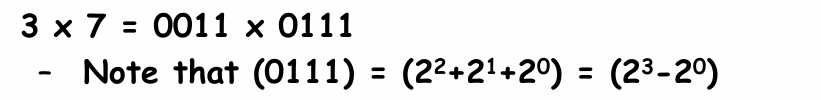
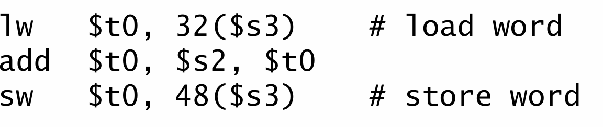

# 老头课内容


## 基础


计算机是一种**电子设备**，由以下部分组成：

- **CPU（中央处理单元）**：负责执行程序指令。
- **内存（Memory）**：存储数据和程序。
- **I/O设备（输入/输出设备）**：与外界交互的接口。
- **总线（Bus）**：连接CPU、内存和I/O设备的通信媒介。


注意逻辑门的出端是否有**小圆点**，如果有则表示**结果取反**


二进制乘法


 半加器（Half Adder）仅能处理**两位二进制数**（xx 和 yy）的加法，输出一个和（S）和一个进位（C）,不考虑前一位的进位输入

 全加器（Full Adder）除了处理两个输入数（x 和 y）外，还接收来自前一位的进位输入（Cin），输出一个和（S）和一个新的进位（Cout 注意公式）。

使用了异或门和与门实现	


补充：


注意**吸收律**，x+yz=(x+y)(x+z)用到了吸收律， **(x+y)(x+x')=x+xy+xx'+x'y=x+x'y 所以x+x'y可以推出x+y**


这里展示了一种新的运算**sum of product**，它用于构建**输入=输出**的布尔表达式


这里的sum 是x,y,cin的异或结果，**cout是在哪一位上进位了**，计算方式som和cout的sum of product的公式为：**先取出本变量二进制位上为1的位置，对于每个位置组合输入，如果该位置上的输入为0，则该输入取反，最后累和**。

术语：minterm——any possible of input 


下图称为Decoder，计算出输入在所有情况下的结果，对于n位输入有$2^n$个输出，wire selector说的是他的输入


下图是Multiplexer，将输入在所有情况下的结果又重新作为输入进行计算，注意**只有一个输出**，这个就是后面的MUX


CPU有三大部分组成：**控制单元（Control Unit**）告诉设备要做什么，**ALU(Arithmetic and Logic Unit)**算数移位逻辑操作，**寄存器**用于临时存储数据，少量但快速.


内存的最小存储单元是**一个bit(single bit)**

内存分类如下

1. **主内存（Main Memory）**：负责存储正在运行的程序和数据，是计算机的主要工作内存。

2. **缓存内存（Cache Memory）**：速度很快但容量较小，主要用于存储主内存中的部分内容，以加快CPU的访问速度。

3. **辅助存储（Secondary Memory）**：容量大但速度较慢，用于长期存储数据和程序，比如硬盘或固态硬盘。


**D-flip-flop是内存的基本单元，存储一比特的数据。**


One's Complement：对正数取反表示负数

**Two's Complement：补码**，注意特殊值，这里的most negative指的是负数的下限，注意要转换为原码来判断，范围是$-2^{n-1}->2^{n}-1$

负数用补码表示的过程：**找出绝对值的原码—>每一位取反->加一**

从补码到原码：**除了符号位**都取反->加一

`


判断溢出就是看**c1^c2是否等于1**：

理解为**最高位(符号位的后一位)是否有进位 异或 符号位是否有进位**


二进制中的乘法运算

对于无符号整数直接求解


对有符号整数，将某一个乘数分解为**2的冥**，转换为**左移**操作然后求和




对于负数，则先转换为**原码**然后**拆分**(除了符号位)，对最后的**结果取反加一**


## Memory

如果输出要依赖**前一时刻**的结果那么就不是combination logic


Latch（锁存器）：锁存器是**电平触发**的存储单元，所谓电平触发就相当于一个**开关**，只有开关打开(一般是低电平)的时候才能修改状态。


SR latch 一种基本的存储元件，属于锁存器的一种。它由两个输入/控制信号（Set **设置1**和 Reset**设置0**）和两个输出（Q 和 Q' 就是not Q）组成，用于存储一个位（0 或 1）的信息，这里的电平信号就是S和R。

$Q^{+}$表示**接收输入信号之后**的状态，Q表示**接收输入信号之前**的状态(可以由S和R那个被设置了求出)，注意这里是NOR门，S和R的位置不能混淆，运算时从s开始**，R=S=1**是不允许的因为矛盾，而都等于0表示**不变**。


D-latch 加入了一个非门使原来的两个置位信号变为**一个**置位信号D(D为1**表示置1**)，**当C=1时电路的新状态为D** 否则不变 图中下面的那条线表示的是**使能信号C**，D锁存器不像SR能保持**状态不变**，它用于消除SR的无效zhuang'tai


Flip-flops（触发器）：只有在时钟信号**上升沿**或**下降沿**才会改变(edge-triggered)，可以用来同步


寄存器和触发器都能储存**一位**的信息，通过把多个寄存器/触发器连接到一起可以储存多位


在分析一个电路图时，首先应该得出每个时序电路的**输入公式**

下图中两个寄存器的输入D1和D2的公式通过**线路反推**可得，D1=Q1'    D2=(X\^Q1\^Q2)


然后找出下一状态Q*的公式，这里因为是D触发器所以Q1\*=Q1’  Q2\*=(X\^Q1\^Q2)

最后判断输出的公式z=(Q1'Q2)


构建真值表，没有特殊的要求从那个状态开始都行

|  X   |  Q2  |  Q1  | Q2*  | Q1*  | Z    |
| :--: | :--: | :--: | :--: | :--: | ---- |
|  0   |  0   |  0   |  0   |  1   | 0    |
|  1   |  0   |  0   |  1   |  1   | 0    |
|  0   |  0   |  1   |  1   |  0   | 0    |
|  1   |  0   |  1   |  0   |  0   | 0    |
|  0   |  1   |  0   |  1   |  1   | 1    |
|  1   |  1   |  0   |  0   |  1   | 1    |
|  0   |  1   |  1   |  0   |  0   | 0    |
|  1   |  1   |  1   |  1   |  0   | 0    |

在真值表的基础上可以得到时序，即通过Q2Q1能得到的Q2'Q1'就是该状态的**下一状态**


为了更直观的表示，可以用状态图的形式，这里的每个节点是**状态排列而成**Q2Q1，**不包括输入**，箭头指向的是**下一状态**，箭头上的是**INPUT/OUTPUT(可以有多个)**，是当前状态转化到下一状态时的输入和输出。状态图不需要方方正正，可以有**自边**


下图展示的是一个使用**D触发器**实现的储存单元逻辑图，四行代表四个字(存储单位)，每一行有三个D触发器分别存储三个输入I0,I1,I2，行选择由地址信号A1,A2决定


移位寄存器，该结构一次脉冲会输入一位信号，这是**串行输入**的方式


分析驱动方程有


状态方程有


输出为Q3


观察得每一次脉冲后下一状态就是**当前状态右移一位得到的**


构建真值表发现，移位寄存器除了**可以移动数据**还可以实现**串行输出和并行输出**


## MIPS

### 基本概念

MIPS指令集是一种精简指令集计算架构，使用**32**个寄存器，每个寄存器宽**32位**（这种大小的位模式称为一个**字** ）。MIPS的数据排列方式是**Big Endian**即**数据的高位放在低地址上**，MIPS指令以**32位**表示。

**寄存器**是CPU内部的高速储存单元，用于**临时存储数据和指令**，MIPS框架下，执行算术运算时，通常**直接对寄存器内的数值操作**而不是直接操作**内存中的数据**，从内存中取数据到寄存器中，再将数据从寄存器中放到内存中。

Compiler must use registers for variables  as much as possible编译器尽可能多的使用寄存器





MIPS遵循：**Simplicity favours  regularity(简单有利于规则)，Smaller is faster(越小越快)**  **Make the common  case fast**快速处理常见情况，**Good design demands good  compromises**好的设计需要好的妥协

相较于机器语言，MIPS更方便，并且可以使用**伪指令(pseudoinstruction)**


该指令集第一个表示**操作**，其后是**左式**，最后的两个是用于**运算**的数，注意MIPS只能进行**两个数之间的运算**，三个及以上的需要用**多个式子**求解，变量的名字是有规律的，**t表示临时变量，s表示变量**，


MIPS中，内存是**字节可寻址**(byte-addressable)的内存，每个内存地址指向**一个字节**的存储空间，想要存储一个字就需要四块连续的地址。


因此内存的地址是**对齐**的，必须是**4的倍数**，用二进制表示就是**末两位为0**

MIPS采用大端序**Big-Endian**，即**数据的高位存储在起始地址**


基本块Basic Blocks是一段**连续指令**，其中指令中不含分支跳转**即按顺序执行**(除了结尾)，并且也不会**从别的地方跳转过来**(除了开头)，编译器会是被这段指令并进行**优化**，更先进的处理器可以**加快**基本块的执行。


### 简单指令

MIPS中默认给的立即数是**十进制**的，想要使用16进制需要用**0x前缀**


注意这个偏移量不能是一个**寄存器**，只能是**整数**

`lb s0, offset($t0)`  取内存中offset($t0)位置的数据到s0中

`sb s0, offset($t0)` 将寄存器中\$s0中一个字节的数据放到offset(\$t0)指定的位置，注意这个顺序。

除了lb,sb还有**lw和sw**表示以**字**为单位取

偏移量offset是一个**16位**的补码从**-32768 到 32767**。括号中的表示这个变量的**基地址**


`la $register, label`  用于加载**标签**（或符号）的地址到寄存器中，一般是在.data中声明的数组，注意不能使用**寄存器**，只能使用**lw**从寄存器中取内容


`and t0, t1, $t2`将t1和t2**按位与**的结果放入t0

`or t0, t1, $t2`将t1和t2**按位或**的结果放入t0

`nor t0, t1, $zero`将t1和t2**按位或反**的结果放入t0


 `sll t1, s3, 2`将s3**左移两位**后的结果放入t1

`srl $t1, $t2, 3`   右移指令

`sra $t1, $t2, 2`右移时左侧会填充对应的符号位

注意**移位指令是R型指令**


`move $dest, $src` 将一个寄存器的值**复制到**另一个寄存器，注意不是移动

`mul $v0,$v0,$a0` 乘法指令


```assembly
div $t0, $t1    # 执行除法，$t0 / $t1

mflo $t2        # 从 $lo 中取出商（结果）
mfhi $t3        # 从 $hi 中取出余数
```


MIPS中立即数只有16位，想要加载一个32位的立即数需要分两步完成

`lui $register, immediate`将立即数左移16位加到寄存器中，即操作高16位

`ori $register, $register, immediate`操作低16位

```assembly
lui $t0, 0xABCD # 0xABCD0000
ori $t0, $t0, 0x1234 # 0xABCD1234
```


数组中的索引8是以**字**为单位的，MIPS中以**字节**为单位，所以换算为**offset偏移量就是32bytes**，对于这个代码先要做的就是**取出数组的值**放到临时变量中然后再进行计算


当索引不是常量时，首先将**索引乘上4**转换为偏移量，然后**和A相加**就得到**A[i]**所在位置，最后用**lw取出该位置的值**即可，此时的偏移量置为**0**


### 寄存器分类


MIPS中有一个**$zero**——0号寄存器，**它的内容永远是零**

PC是一个特殊的寄存器，**指向当前指令**，当一条指令执行完毕后会**自动加4**

**立即数**是一个**有符号常量**，它可以作为数据来源之一用于某些操作，而不是使用寄存器中的值，要使用立即数的话需要用到指令**addi**，例如**addi \$s3, $s3, 4**，这里没有**subi**指令，想实现**减法**就要用负数来做

实际编写MIPS指令时，寄存器位置写0会默认给的是$zero


### 三种指令类型

MIPS操作指令可以分为三种：**R型(寄存器型 寄存器寻址)，I型(立即数型 立即数寻址 基址寻址)，J型(跳转型 伪立即数寻址)** 内存中分配rs和rt的位置一般和MIPS指令的顺序是**反的**


OP(opcode)：操作码，**所有R型指令都为0**	

rs rt rd分别是**两个源操作数**的**寄存器编号**和**目的操作数**的**寄存器编号**

shamt 常数，在移位指令中使用

func(extend opcode) 功能码指定指令的**具体功能** 32是add 34是subtract

除了op,func是**六位**其他都是五位


OP 决定操作功能 35 load  43 store

rs immediate分别指第一个源操作数**寄存器编号**，和第二个源操作数（**16位的有符号整数**）

**rt是目的操作数所在的寄存器编号**


OP 确定操作类型

address/offfset 地址

实际的地址是**32**位的，MIPS采用了一种伪直接跳转的机制：将26位的地址**扩展**到32位——先将26位地址左移两位，然后与**PC的高四位**得到最终的地址


### 判等

`beq rs, rt, L1`**判断是否相等**，如果相等则**跳转到L1**标签指定的位置，反之**继续往下**执行。注意该指令是I型指令，跳转到的位置是**PC+offset*4**，这里的PC**已经加四了**。

`bne rs, rt, L1`原理同上 注意比较的是**两个寄存器**中的值而不是寄存器与**整数**

观察下图，发现bne指令执行时如果成功，则会跳转到80024，这因为**PC+offset\*4=80016+2\*4**、


### 比较大小

比较\$rt和$rs的值将结果存到\$rd，注意是不等比较

`slt rd, rs, rt`  **if (rs < rt) rd = 1; else rd = 0;**

`slti rt, rs, constant`**if (rs < constant) rt = 1; else rt = 0;**


通过和bne指令结合实现**不等式判断**

`slt $t0, $s1, $s2`

`bne $t0, $zero, L` 


sltu, sltui比较的是**无符号整数**

这里这推荐使用=和!=而不是>=或者<=，因为前者在硬件上实现更快，他们是common case 也是一个good design compromise


## More MIPS

### 汇编器指令


在 MIPS 中，*Assembler Directives*（汇编器指令）是用来指导汇编器如何处理代码的一种特殊指令。与 MIPS 指令不同，这些指令不会被直接翻译为机器代码，而是用于设置数据的布局、定义符号和存储器空间等。常见的汇编器指令有以下几种：

1. **`.text`**：用于定义**代码段**的起始位置。汇编器将把接下来的代码放入程序的代码段中。

2. **`.data`**：用于定义**数据段**的起始位置。汇编器会将接下来的数据放入数据段中。

3. **`.word`**：用于在内存中**分配一个或多个 32 位整数**。例如，`.word 5` 会将值 `5` 存入一个 32 位的存储空间中。

4. **`.asciiz`**：用于定义一个**以零字节（`null` 字符）结尾的字符串**。例如，`.asciiz "Hello"` 会在内存中存储字符串 `"Hello\0"`，要用**双引号**。

5. **`.globl`**：用于声明一个**全局标签**，使该标签在其他文件中可见。例如，`.globl main` 会使 `main` 标签在整个程序中可用。

MIPS中标识符的命名规则和其它语言中一样使用**数组字母和下划线**


### 地址类型

- 立即寻址(immediate addressing) I型指令的`addi  $a0, $zero, 1`
- 寄存器寻址(register addressing) R型指令的 `add $rd, $rs, $rt`
- 基址寻址(baseing addressing) ` lw  $rd, displacement($base_register)`
- PC相对寻址(PC-relative addressing)  `beq $t0, $t1, label`
- 伪直接寻址(pseudo addressign)  `j label` 


### 系统调用

MIPS可以使用**系统调用system call**，系统调用最多**传四个参数\$a0 -\$a3** 在执行系统调用时**\$v0** 通常用来指定调用的**服务类型**，系统调用的**返回值**也会存在$v0中


li（Load Immediate）**将一个立即数加载到寄存器中**

la(Load Address) **将变量的地址加载到一个寄存器中**，注意该指令只能操作.data下声明的**变量**，而不能是一个**寄存器**

一般系统调用搭配这两种指令(**伪指令不属于MIPS，需要使用汇编器翻译**)使用

```assembly
# 将一个立即数加载到 $v0 中
li $v0, 10  # 将 10 加载到 $v0，通常用于表示一个系统调用（如退出程序）
syscall      # 执行系统调用

la $a0,str   # 传递参数
li $v0,4    # 输出指令
syscall # to print
```


### jal指令


**jal**指令jump and link，可以看作是**调用函数**指令，执行后先把下一条指令的位置即**PC+4保存到$ra**，然后**跳转到函数的地址**上，在函数末尾使用**jr $ra**用来返回调用该函数的位置

callee是被调用的函数

调用函数的四个过程：传递参数pass parameter，转移控制权transferring control，存返回值pass result，返还控制权returning control


### 例子

MIPS指令集中非常容易混淆寄存器，要注意

MIPS指令中跳转标签后要记得再**跳回去**，否则会迷失


遍历输出数组的代码

```assembly
.data
arr:  .word 7, 9, 4, 3, 8, 1, 6, 2, 5 # 注意这里需要用空格隔开每个数据

.text
.globl main # 规定了入口位置 注意拼写

main: 
	li $v0,1 # 设置系统调用，输出整数指令
	addi $t0,$0,0 # i=0 addi需要用到一个寄存器所以这里传入一个$0
	addi $t1,$0,9 # n=9
	la $t3,arr # 存储数组变量，用取址命令

loop:
	slt $t4,$t0,$t1 # i<n 如果是则t4=1 反之t4=0
	beq $t4,0, done # 这里的0是$0的简写，注意不能写除了0以外的整数 因为beq指令是比较寄存器nei'rong'de
	lw $a0,0($t3) # 用lw指令取出数组中的内容
	syscall
	addi $t3,$t3,4 # 更新索引
	addi $t0,$t0,1
	j loop

done:
	li $v0,10
	syscall
```


下面是一段遍历数组求和的代码

```assembly
.data 
arr: .word 1, 2, 3, 4, 5, 6, 7
msg: .asciiz " The sum of the arr is "

.text
.globl main

main: 
	li $t0,0 # i=0
	li $t1,7 # n=7
	li  $t2,0 # 总和
	la $t4,arr # 加载数组
loop:
	slt $t3,$t0,$t1 # i<n
	beq $t3,0,done
	lw $t3 ,0($t4) # 加载数组元素 注意要用lw
	add $t2,$t2,$t3	# 累和 这里用到的是两个寄存器，因此用add指令
	addi $t0,$t0,1
	addi $t4,$t4,4
	j loop

done:
	li $v0,4 # 输出字符串
	la $a0,msg	# 加载字符串向加载数组一样用la
	syscall

	li $v0, 1 # 输出数字
	add $a0,$0,$t2
	syscall 
	
	li $v0,10
	syscall
```


下面是一个将数组中所有的元素置为0的代码，值得一提的是 **sll和slt**容易混淆

```assembly
.data 
arr: .word 1, 2, 3, 4, 5, 6, 7

.text
.globl main

main: 
	li $t0,0 # i=0
	li $t1,7 # n=7
	la $t4,arr # 加载数组
loop:
	slt $t3,$t0,$t1 # i<n
	beq $t3,0,done
	
	sw $0, 0($t4) # 将数组元素置为0，可以用$0

	addi $t0,$t0,1
	addi $t4,$t4,4
	j loop

done:
	li $v0, 1 # 输出数字
	lw $t0,-4($t4) # 这里指针指向数组外边，因此用偏移量往回移
	move $a0,$t0 # 设置系统调用的参数
	syscall 
	
	li $v0,10
	syscall
```


取最大值

```assembly
.data 
    arr: .word 1, 2, 73, 4, 5, 6

.text 
.globl main

main:
    la $t0,arr
    li $s0,-1
    li $t1,0
    li $t2,6

loop1:
    sll $t3,$t1,2
    add $t4,$t0, $t3

    lw $t5,0($t4)
	# 取最大值的逻辑没必要写一个函数，可以把循环分两段，如果不用更新则继续后半段循环跳过更新逻辑    
    slt $t6,$s0,$t5
    beq $t6,$0,loop2

    move $s0,$t5

loop2:
    addi $t1,$t1,1

    slt $t5,$t1,$t2
    beq $t5,$0, exit
    j loop1 

exit:
    move $a0,$s0
    li $v0,1
    syscall 
    li $v0,10
    syscall 

 
```


数组取值的另一种方式：不操作数组地址而是用一个索引值**>>2**，再与数组首地址**相加**求出索引所对的地址。

```assembly
$t1 ->idx
$v1 -> count数组

sll $t1,$t1,2 $ # 先左移2
add $t2,$t1,$v1 # 与数组首地址相加
```


顺带一提，给的C代码中的**arr[i]和i[arr]**等价


递归实现阶乘函数，**函数内部**调用任何函数之前一定要先保存**$ra**，函数结束前**要恢复栈**

```assembly
.globl .main
main:
	addi $a0,$0,5 # n=5
	jal fact # 调用函数
	move $a0,$v0 # 将函数返回结果放入#a0
	li $v0,1 # 输出数字
	syscall 
	
	li $v0 ,10 # 退出
	syscall

fact:
	slti $t1,$a0,1 # 如果小于1那么执行none 注意指令是slti
	beq $t1,1,none
	
	addi $sp,$sp,-8 # 开栈
	sw $ra,4($sp) # 储存返回值和n
	sw $a0,0($sp)
	addi $a0,$a0,-1 # n-=1
	jal fact # 递归
	lw $a0,0($sp) # 取出存放在栈中的值
	lw $ra,4($sp)
	mul $v0,$v0,$a0 # n*f(n-1)
	addi $sp,$sp,8 # 恢复栈
	jr $ra

none: 
	addi $v0,$0,1 # 返回1
	jr $ra
	
```


实现斐波那契数列

```assembly
.text
.globl main

main:
	addi $a0,$0,2  # 设置n
	jal fibo # 调用函数
	move $a0,$v0 # 保存返回结果
	li $v0,1 # 系统调用
	syscall 
	
	li $v0,10
	syscall 

fibo:
	slti $t0,$a0,2 # 小于2执行done，注意slti实现的是小于而不是小于等于
	beq $t0,1,done 
	addi $sp,$sp,-12 # 开栈
	sw $ra,4($sp) # 存返回值
	sw $a0,0($sp) # 存n

	addi $a0,$a0,-1 # n-=1
	jal fibo # fibo(n-1)

	sw $v0,8($sp) # 因为要调用两次，所以返回的结果要先保存

	lw $a0,0($sp) # 取出n
	addi $a0,$a0,-2 # n-=2
	
	jal fibo # fibo(n-2)
	lw $t1,8($sp) # 取出fibo(n-1)的结果
	add $v0,$v0,$t1 # 将fibo(n-1)+fibo(n-2)放到返回寄存器中
	
	lw $ra,4($sp) # 注意在返回前一定要取出$ra
	addi $sp,$sp,12 # 恢复栈
	j $ra

done:
	addi $v0,$0,1 # 直接返回1
	j $ra
```


### 栈(LIFO)

MIPS汇编中有栈顶指针 **$sp** ，该栈顶指针**不会直接参与对栈内元素的访问**，其作用仅在于确定栈**边界**——栈顶指针会**一次性地**向下移动若干字节，开辟新的内存空间以使用，MIPS中没有**push和pop**指令，所有对栈中元素的访问都是基于栈顶指针 **sp** 和**偏移量**完成的，栈划分的空间**从高地址到低地址**，$sp始终指向**top** of stack


​								


MIPS传递参数时，会将所有参数分为两个部分：**前四个参数以及其他参数**，其中前四个参数会从左往右依次放入寄存器**$a0~\$a3**中，而其它参数会从右往左依次压入栈，多出的返回值也会使用栈存储。

栈有**共享数据**和**保存数据**的作用


非叶子函数在执行时应**将变量保存到栈中**，因为MIPS中只有**32**个寄存器，所以很可能会出现**寄存器复用**，导致数据被**覆盖丢失**

比如保存函数返回值的**$ra**。因此非叶子函数在调用下一层函数前需要**将当前的状态保存到栈中**，当调用函数返回后，再从栈中取出存储的值，注意一定要**恢复**栈，否则在其他函数中使用栈时会错乱。


## Single cycle

single cycle（单周期）是一种处理器**实现方式**，在这种架构下，指令的执行在**一个时钟周期**内完成。也就是说，从取指令、解码、执行、访存到写回的整个过程，都在一个时钟周期内完成，不会有**中间结果**被储存，单周期的计算是**combinational**的


在该架构下的逻辑门可以一次性处理**多位**；

MUX是一个多路复用器，根据**控制信号**的值，**在多个输入信号中选择一个输出**；

ALU是运算运算逻辑单元，根据输入的**OP指令**执行算术操作。


寄存器结构在D锁存器的基础上可以处理**多位**并多了一个**Write Enable**信号


Register File寄存器文件，其中存储了**32个32位的寄存器**，在硬件层面上通常实现为一个**多端口的内存**，允许同时进行多个读写操作**两个读端口RD（用于输出寄存器内容）和一个写端口WD（用于输入）**


**取指**过程，通过PC在instruction memory中取出对应的指令，然后更新PC，处理器**每轮**操作都会执行，因此该过程不需要**控制信号**


以下是几个典型的指令运行时的Datapath


如果**相等**，则会将零信号设置为**1**(因为只有相等才会跳转)，这里可以看到执行branch时，**PC已经加4**


add指令不需要操作内存


jump的实现，先将偏移量左移再拼接


指令的实际执行过程会更加复杂一些，MIPS硬件设计考虑了所有的指令类型，因此线路会比较复杂，实现中使用MUX接收**控制信号**来选择相应的**输入信号**，控制信号是考察的**重点**


R型指令

因为不需要**从内存中读取数据**又要**回到寄存器文件**所以MemotoReg=0


lw指令，从内存取出数据返回寄存器文件，所以MemotoReg=1


sw指令

不需要回到寄存器文件所以MemotoReg和RegDist不会被设置


beq指令

ALU中做减法操作，不需要写回寄存器所以MemotoReg和RegDist不会被设置


七个1b的信号和一个2b的Aluop

+ **RegDist** 用于选择寄存器目标。当指令类型是 R-type 时，`RegDst = 1`，选择指令中的 **rd** 作为目标寄存器；对于 I-type 和 J-type 指令，`RegDst = 0`，选择 **rt** 作为目标寄存器。

+ **RegWrite** 当 `RegWrite = 1` 时，将数据写回到寄存器堆

+ **PCsrc** 执行**beq**等指令**跳转标签**时为1，控制 `PC` 是增加 4（顺序执行）还是跳转到新地址 是**zero&branch**求出

+ **MemRead** 当 `MemRead = 1` 时，从数据内存中读取数据。通常用于 **load** 指令

+ **MemWrite**：当 `MemWrite = 1` 时，将数据写入数据内存。通常用于 **store** 指令

+ **MemtoReg**  如果 `MemtoReg = 1`，则将从数据内存读取的数据写入寄存器；如果 `MemtoReg = 0`，则写入 ALU 计算的结果。

+ **ALUSrc** 控制 ALU 的第二个操作数是来自寄存器堆（`ReadReg2`）还是立即数（来自指令的 **imm** 字段）。`ALUSrc = 1` 时，ALU 的第二个操作数是立即数。

+ **Branch**：当 `Branch = 1` 时，指令是一个分支指令，如果ALU计算出的**zero信号**也为一则PC 应该更新为分支目标地址（当前地址加上一个偏移量）。

+ JUMP：决定跳转

  


控制信号由**control unit**给出


input：指令的高6位，也就是指令的**op字段**

output：**2位的ALUOp**(输入到ALU control)，内存的**Read/Write signal** ，各个多路复用器的**控制信号**selector control 


PLA是任何逻辑输入都能写成sum of pr


对ALU Control


input：**2位的ALUOp**和指令的低6位(R型指令的**func字段**)

output：**3位的ALU控制变量**，决定ALU单元执行的操作


结合control unit 和ALU control结果表发现：R型指令得到的**ALUOp=10**，它采取的运算操作由**func字段**决定；lw&sw指令得到的**ALUOp=00**，它的运算一定是**加法**操作与低六位无关，恰好I型指令的低六位**没有任何意义**因为包括在偏移量中；beq指令得到的**ALUOp=01**，对应的运算是**减法**，与前面同理。


描述步骤lw：

1. Fetch instruction and increment PC 取指，更新PC
2. Read base register from the register file 读取寄存器
3. ALU compute the sum of value  reading from register and sign-extended 16bits offset
4. Read data from memory
5. Data write into register


描述步骤branch：

1. Fetch instruction and increment PC 取指，更新PC
2. Read base register from the register file 读取寄存器
3. ALU calculate the subtract of two values and PC+4 is added to sign-extended 16bit offset which is shifted left by two
4. the Zero result from the ALU is used to decide which adder result t be saved in PC


 


**单周期**的实现并**没被采用**：每个指令都必须在**一个时钟周期**内完成，所以时钟周期的长度**必须足够长**(一般由处理器中**最长的指令**决定，基本上是**I型**指令)，而计算机设计的原则是**Make the common case fast**，即让常见的情况更快，单周期中所有指令**共享同样的时钟周期**，一些**简单**的指令本可以**更快**的完成但执行时间被**强制延长**了，浪费了**系统潜力**。


## pipeline

MIPS流水线架构将指令执行过程分解为多个阶段，并让不同的指令在流水线中并行执行，以提高指令的吞吐量。


一个流水线的简单的例子如下，可以并行处理多个指令


Latency(延迟)指**一条指令完成所需的是时间**，**首条指令**一般不做参考

Throughput(吞吐量)**指单位时间内能完成的指令数量**，等于**1/最耗时的阶段**


以洗衣服的过程为例，假设洗衣服需要20min，烘干衣服需要40min，那么从流水线的角度出发，延时=80min(20洗衣服+20等待前一个完成+40烘干)，吞吐量=1/40，如果从线性执行的角度出发，延时=60，吞吐量=1/60


pipeline设计**不能降低单个任务延时，但可以提高总的工作的吞吐量**。


如下所示是三个流水线阶段


吞吐量**thoughput=1/(150+20)**由**最耗时**的阶段决定，**总的延时=所有阶段耗时之和**

这里OP1A任务执行完成后不会立即执行OP2的A任务，这是因为流水线的操作是**同步时钟驱动**的，每个任务都需要在**时钟边缘切换时**完成并传递到下一个任务，而流水线的时钟周期是基于 **最慢阶段**决定的


single-cycle的周期是**所有阶段之和**，pipeline是**最长的阶段**


流水线的**加速比(speedup)**理想情况下=**流水线阶段的数量**，然而流水线中的各个阶段耗时不同时，**最慢的阶段将限制加速比**，**同时在流水线刚启动时需要时间来填满每个阶段(fill)，完成最后一个阶段是也需要时间清空所有阶段(drain)**，这同样会降低加速比。


MIPS语言适合使用pipeline，原因如下

+ **所有指令长度相同**
+ **MIPS指令集只使用几种简单的指令格式**
+ **内存操作只在load/store指令中出现**
+ **操作数对齐在内存中**


MIPS流水线中有五个阶段

| **阶段** | **主要任务**                   | **涉及的硬件**       |
| -------- | ------------------------------ | -------------------- |
| **IF**   | 取指，计算下一条指令地址       | PC, 指令存储器       |
| **ID**   | 译码，读取寄存器，生成控制信号 | 寄存器文件，控制单元 |
| **EX**   | 执行运算，地址计算，分支判断   | ALU, 分支判断逻辑    |
| **MEM**  | 访问数据存储器                 | 数据存储器           |
| **WB**   | 将结果写回寄存器               | 寄存器文件           |


多周期(Multiple-Clock-Cycle)中**WB是在第四个阶段**，而流水线设计中是在**第五个阶段**，这两种实现的最大的不同是：流水线中使用**分段寄存器来耦合五个阶段**。


流水线中的信号控制

+ **pipeling Register，PC，指令内存，寄存器文件不需要信号控制，因为它们每个周期都更新**
+ **需要对每个阶段设置一组控制信号(control signal)，但实际上取指和译指没有什么可控制的，因此不需要设置**


**分段寄存器(pipeling Register)**用于在指令从一个流水线阶段**传递**到下一个阶段时**临时保存数据和控制信号**，一共有四个分段寄存器，**注意这个寄存器的能储存的大小**，**后三个寄存器**的实际的大小要**加五**，因为存储并传递**控制信号**。


**控制信号也是通过Pipeline register连续传递的**


如下所示是一个lw指令的在流水线架构下的运行过程，图中的阴影表示读写操作，**左半部分写，右半部分读**


MIPS流水线设计中，lw和算数指令会用到**写回寄存器**，写回寄存器的信息是在**ID阶段获得**，但只有在**WB阶段才会使用**，写回寄存器通过分段寄存器**逐阶段传递信息**，保证流水线正确地将数据写入目标寄存器。这里write register记录寄存器的编号，write data 将数据写入到对应的寄存器中


sw指令不会写回内存，因此在**写回阶段不会发生任何事**


## pipeline hazard 

流水线有三大冲突：

+ **结构冲突(structrual hazard)多条指令同时使用一种硬件资源，而该资源无法满足要求。**MIPS的设计很容易避免这种冲突
+ **数据冲突(data hazard)，一条指令的计算依赖于前一条指令的结果，并且之前的结果还没有准备好**
+ **控制冲突(control hazard)，当程序遇到分支/跳转指令的时候不知道接下来要执行拿一条指令**


### 数据冲突


遇到数据冲突的第一种解决方法是**编译器能保证不发生冲突**通过**重新排列指令**或者在指令之间**停顿产生气泡**

所谓的气泡就是无意义的指令，`nop=sll $0, $0, 0` 32位1


第二种方法是**数据前递(forward)**，允许用于ALU的输入可以**来自后面的pipeline register**，而**不依赖寄存器文件**


数据前递首先要求能够**发现数据冲突**，通过比较分段寄存器中保存的寄存器编号，如果**后面阶段寄存器中的目标寄存器与前面阶段寄存器中的源寄存器一样则存在冲突**，这里从后一条指令的视角出发的，数据不仅可以来自**EX/MEM也可以来自MEM/WB**


需要判断之前的指令是否是要将内容**写入**到寄存器，如果不用就不需要前递，如果**目标寄存器是0**也不需要，因为0寄存器是不会被更改的。

因为有**两个源寄存器**，所以会进行两次判断

来自前一条指令


前前一条指令


Forwarding unit是一个硬件实现，它接受**两个目的寄存器和两个源寄存器以及WB中的RegWrite信号进行判断**，如果发生了数据前递则会将前递的数据用作ALU的输入。


数据前递不能解决**所有**的数据冲突，对于**lw**指令，它之后的指令在Execute阶段时，lw从内存中取出的数据还没有放到Pipeline register中。


这里的检测**以lw为视角**的，通过判断**MemRead**信号来判断是否是lw指令，只有lw指令会设置该信号，然后还要看**lw的目的寄存器是否与前一条指令的源寄存器冲突**。注意**LW指令是在EX阶段**，判断的**寄存器是rt**， 因为I型指令中**rt是目的寄存器**。


检测到lw引起的数据冲突后通过**stall停顿**来解决冲突

+ **IF/ID寄存器会停止写入，PC停止更新**
+ **设置 EX, MEM 和WB的控制信号为0，这样可以让下一条指令变为nop(00.....0000—32)**
+ **不能将当前指令变为nop，因为当前指令已经解码**


检测数据冲突和停顿的通过**Hazard Detection Uni**t实现的


发现有lw造成的数据冲突后会进行停顿——禁止PC寄存器和IF/ID寄存器更新，将EX, MEM 和WB的控制信号设置为0


注意这里并没有清空ID/EX寄存器的内容，所以依旧会发送数据前递。


编译器可以通过重新**安排指令的顺序**来避免冲突和停顿


### 分支冲突

分支冲突的一大问题在于当得知分支的结果时，**分支命令已经位于MEM阶段**，此时流水线中已经读入了**错误的指令**。


第一种解决方案是**流水线停顿(stall)，产生空泡**，可以理解为让前面的指令先执行一段时间，然后再继续，但是气泡会**降低效率**。


第二种方法是**预测分支**是否执行先继续下去，有一半的可能正确。

+ 一般是**预测分支不会执行**，只需要继续执行之后的指令就行了。

+ 如果预测错了那么需要清除在分支之后已经进入流水线的指令


由于分支指令的结果在**MEM阶段**得到，则流水线中会包含**三个之后的指令**。

为了减少分支延时需要将分支的判断移动到**ID阶段**，在这个阶段已经得到了寄存器中存储的地址以及立即数，这里通过将两个地址**按位异或**来判断是否相等（ALU中通过相减再与0比较），这种判断方法**更加高效**不会对该阶段有较大的延长。

同时需要修改**forwarding unit将数据从更早的阶段转发到ID阶段，detection hazard unit产生停顿**

当在ID阶段确定了要跳转时，**IF此时读入的指令时无效的**，需要刷新掉，这里的刷新实际上就是替换为**Nop**，注意**只刷新一条指令**，因为只取了一条指令，通过**IF.FLUSH信号清空掉IF/ID中的指令(即分支之后的第一条指令)**，这个控制信号来自 **Control Uni**


之后


第三种方法是**调整指令执行的顺序**，将与分支无关的指令放到分支指令的后面(编译器的工作)


## Cache Memory

### 为什么需要缓存

**程序**是运行在**主存**中的，当需要一个进程的时候会首先**从磁盘中将程序load到主存**中，然后开始执行。

在CPU内部，如果要将一个变量的值加一，一般分为以下三个步骤

+ 磁盘设备将可执行程序Load到主存中
+ CPU从主存中读取变量的值到**内部的寄存器**中
+ 寄存器执行**运算**
+ 将**值存储到主存**


这个过程中，**寄存器的读写速度与主存的速度相差百倍**，这段延迟会导致CPU的流水线**停顿(stall)**，因此**降低了效率**。如果想要速度更快且容量也很大的主存，那么成本将会很高，因此提出了一种折中的办法，那就是制作一块速度极快但是容量极小的存储设备，也就是缓存，**放置到主存与CPU之间作为一个通道**。

当CPU需要数据时，会先从缓存中查找对应的数据地址是否存在，如果存在则直接取数据


CPU和主存之间直接数据传输的方式转变成**CPU和Cache之间直接数据传输**


### POL

Programs access a small portion of memory  within a short time period

**Principle of locality(POL)局部性原理**: 

1. **Temporal locality空间局部性:** recently accessed memory  locations will likely be accessed soon。缓存会保存最近访问过的内存块并丢弃不常使用的。
2. **Spatial locality空间局部性**: memory locations near recently  accessed locations will likely be accessed soon。缓存通过**将多个相邻的字节一起存储为一个缓存块**来体现空间局部性，一般是64B或128B


### RAM

RAM是随机存取存储器，一旦断电所存储的数据将随之丢失，分为**静态(SRAM)和动态(DRAM)**。SRAM的**速度快但昂贵**，一般用小容量的SRAM作为更高速CPU和较低速DRAM 之间的缓存（cache）

### 多级Cache存储结构

由于**缓存容量较小**，当缓存器中没有数据时会**从内存中取得**，这会导致仍然需要等待一段时间，因此为了进一步提升性能，引入了**多级缓存结构**，等级越高容量越大速度越慢，但是也快于主存。

+ **L1**(SRAM)：L1缓存**在CPU上**，L1 Cache分为单独的**Instruction Cache(ICache)和Data Cache(DCache)**，分别用于存储程序指令和数据。
+ **L2**(SRAM)：L2缓存**不区分指令和数据，都可以缓存**。L2缓存要么**位于芯片内部，要么是外部缓存**（如果是外部缓存，通常位于主板上）。有的计算机中存在L3缓存
+ **主内存**(DRAM)：用于存储程序和数据，尽管它较慢，但提供了大容量的存储空间。

+ **I/O**最后一级


### 名词解释

1. **命中（hit）： CPU要访问的数据在Cache中有缓存**
2. **缺失（miss）： CPU要访问的数据在Cache中没有缓存**
3. **Cache Size：Cache的大小，代表Cache可以缓存最大数据的大小**
4. **Cache Line：Cache会被平均分成很多相等的块，每一个块大小称之为Cache Line Size；将64 Bytes平均分成8块，那么Cache Line就是8字节，总共8行Cache Line**

**Cache Line是Cache和主存之间数据传输的最小单位。**当CPU试图load一个字节数据的时候，如果Cache缺失，那么Cache控制器会从主存中一次性的load一个**Cache Line大小的数据到Cache中**。例如，Cache Line大小是8字节。CPU即使读取一个Byte，在Cache 出现miss后，Cache会从主存中load 8字节填充整个Cache Line。


### 多级缓存的配合工作

处理内存访问请求时

1. **搜索L1缓存**：如果命中，那么操作完成，直接从L1缓存中读取数据，>=90%的指令或数据可以在l1中找到
2. **L1 Cache缺失，则继续从L2 Cache中查找**：如果命中，数据会返回给L1以及CPU。
3. **L2 Cache也缺失，需要从主存中load数据**：如果命中，将数据返回给L2 Cache、L1 Cache及CPU，主内存的访问频率**较少**
4. **最后从I/O获取数据**：如果数据不在L1缓存、L2缓存、或者主内存中，那么最终会从I/O设备中获取数据。这通常是最慢的操作，因为I/O设备（如磁盘）访问速度比内存慢得多。


### Cache结构

Cache因为容量较小所以存储内存数据的一个**子集**

整个缓存被划分为**一个或多个set(组)**，每个set包含一个或多个**cache line**，每个cache line由三部分组成：

1. **有效位valid：长度为一个比特，表示当前cache line存储的信息是否有效(1为真) 初始时都为0** 
2. **标记tag：确定目标数据是否在cache line中**
3. **data：存储的数据**

缓存的大小(Cache Size)是指**所有数据大小的和而不包括标记和有效位**。


当CPU执行load从内存地址A处读取数据时， CPU会将地址发送到缓存中， 如果缓存中保存着副本那么就目标数据发回到CPU

注意Cache line 存储的是**一个块**，即内存中**一段连续的数据**，而不是某一个内存


### 直接映射缓存(Direct mapped Cache)

当每个set只有**一个cache line时**，称为直接映射。


以一个Cache Size 为 128 Bytes 并且Data是 16 Bytes的Cache为例，假设现在有地址0000,0110,0101,0100，接下来开始划分地址，**主存地址=Tag+Index+Offset**

- Data是16B，那么就要取出地址的**低4位**作为offset
- 一共有128/16=8个Set，那么**index(标识第几个set从0开始)就是取出了低4位后的低3位**
- **剩余的部分就是tag**


判断缓存是否命中分为三步：

+ **组选择：根据目标地址的index找到第5个cache line**
+ **行匹配：比较目标地址的tag与cache line中的tag，如果不同或valid=0则出现缺失，将会从下一层存储结构取出块进行替换(least recently used replacement policy)，反之进行字抽取**
+ **字抽取：根据偏移量在cache line中取出对应的数据(因为cache line存储的是一个块)**

注意缓存会**一次**从内存中加载**一个块**的数据


对于**16位**的机器，缓存是直接映射的，每个块都只有**一个字节**

直接映射的缺点是数据之间会出现冲突，当要访问的数据发生冲突是，就会从下一级结构中取数据然后替换，当出现连续的冲突时，CPU相当于从主存中取数据而不是内存中取数据，这会导致效率底下。


### 组相联(Associative Cache)

以两路组相联缓存为例，将Cache平均分为两份128->64


这种方式中offset不变，但是index要减小，因为这里从8变为4，那么index只能取2位了，同时tag会变大，因为tag是剩下的部分。


此时匹配数据，通过index找到对应的组，然后将组中所有的tag取出来进行对比，如果其中一个相等就意味这命中。


两路组相连缓存较直接映射缓存最大的差异就是：某一地址数据可以存储于对应组内的2个Cache Line，而直接映射缓存一个地址只对应一个固定的Cache Line


### 全相连缓存（Full associative Cache）

所有的Cache line 都位于一个组中，也就是数据可以存放到任何的cache block(data字段)中，此时不会再有任何冲突了。


offset不变

因为只有一个组，因此索引为0

tag就是剩余的


